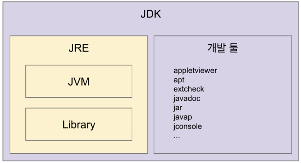

## 자바, JVM, JDK, JRE
목표: 이것들이 뭔지, 뭐가 다른지 이해한다.  
  
JVM(Java Virtual Machine)
- 자바 가장 머신으로 자바 바이트 코드(.class 파일)를 OS에 특화된 코드로 변환(인터프리터와 JIT 컴파일러)하여 실행한다.
- 바이트 코드를 실행하는 표준(JVM 자체는 표준)이자 구현체(특정 밴더가 구현한 JVM)다.
- JVM 스팩: https://docs.oracle.com/javase/specs/jvms/se11/html
- JVM 밴더: 오라클, 아마존, AZUL ...
- 특정 플랫폼에 종속적(OS에 의존적)

JRE(Java Runtime Environment): JVM + 라이브러리
- **자바 애플리케이션을 실행**할 수 있도록 구성된 배포판.
- JVM과 핵심 라이브러리 및 자바 런타임 환경에서 사용하는 프로퍼티 새팅이나 리소스 파일을 가지고 있다.
- 개발 관련 도구는 포함하지 않는다. (그건 JDK에서 제공)

JDK(Java Development Kit): JRE + 개발툴
- JRE + 개발에 필요한 툴
- 소스코드를 작성할 때 사용하는 자바 언어는 플랫폼에 독립적
- 오라클은 JAVA11 부터는 JDK만 제공하며 JRE를 따로 제공하지 않는다.
- Write Once Run Anywhere

자바
- 프로그래밍 언어
- JDK에 들어있는 자바 컴파일러(javac)를 사용하여 바이트코드(.class 파일)로 컴파일 할 수 있다.

JVM 언어
- JVM 기반으로 동작하는 프로그래밍 언어
- 클로저, 그루비, JRuby, Jython, Kotlin, Scala, ...

참고
- JIT 컴파일러: https://aboullaite.me/understanding-jit-compiler-just-in-time-compiler/
- JDK, JRE 그리고 JVM: https://howtodoinjava.com/java/basics/jdk-jre-jvm/
- https://en.wikipedia.org/wiki/List_of_JVM_languages
___

### 예제

```java
public class HelloJava {
    public static void main(String args[]) {
        System.out.println("Hello, Java");
    }
}
```

```shell
javac Hello.java
# 컴파일 하면 클래스 파일이 나옴
# HelloJava.class

# 바이트 코드를 볼수 있다.
javap -c HelloJava
# Compiled from "HelloJava.java"
# public class HelloJava {
#   public HelloJava();
#     Code:
#        0: aload_0
#        1: invokespecial #1                  // Method java/lang/Object."<init>":()V
#        4: return
# 
#   public static void main(java.lang.String[]);
#     Code:
#        0: getstatic     #2                  // Field java/lang/System.out:Ljava/io/PrintStream;
#        3: ldc           #3                  // String Hello, Java
#        5: invokevirtual #4                  // Method java/io/PrintStream.println:(Ljava/lang/String;)V
#        8: return
# }
```