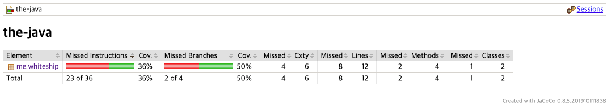

## 코드 커버리지는 어떻게 측정할가?

코드 커버리지
- JaCoCo를 써보자.
- https://www.eclemma.org/jacoco/trunk/doc/index.html
- http://www.semdesigns.com/Company/Publications/TestCoverage.pdf

pom.xml 에 플러그인 추가

```xml

<plugin>
    <groupId>org.jacoco</groupId>
    <artifactId>jacoco-maven-plugin</artifactId>
    <version>0.8.4</version>
    <executions>
        <execution>
            <goals>
                <goal>prepare-agent</goal>
            </goals>
        </execution>
        <execution>
            <id>report</id>
            <phase>prepare-package</phase>
            <goals>
                <goal>report</goal>
            </goals>
        </execution>
    </executions>
</plugin>
```
```shell
# 실행시 /target/site/jacoco.index.html 파일이 생성
mvn verify
```
> 이유는 모르겠으나 `<pluginManagement>` 하위에 있으면 site 디렉토리가 생성되지 않음  

**jacoco 화면**
  


